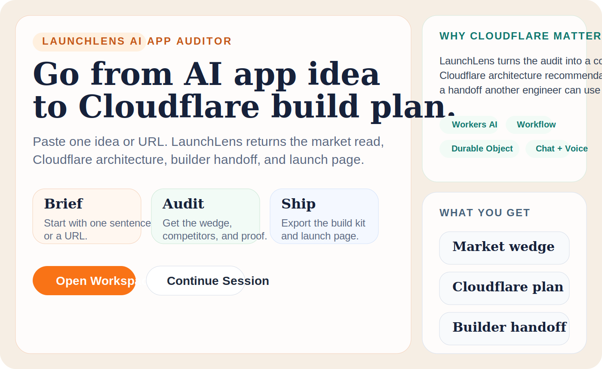
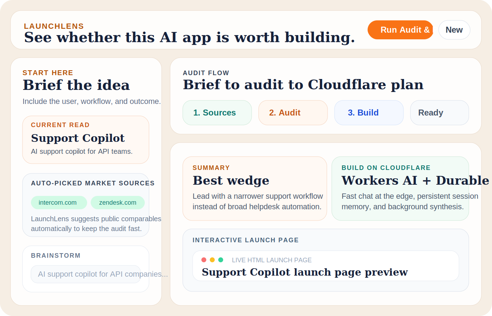

# LaunchLens AI App Auditor

LaunchLens is a Cloudflare-native AI app auditor for the moment before a team starts building.

You paste an AI app idea or product URL, and LaunchLens turns it into:

- a sharper market wedge
- likely competitors and market signals
- a Cloudflare architecture recommendation
- a markdown build handoff for another engineer or coding agent
- an interactive HTML launch page for fast review

This makes the project useful for a Cloudflare reviewer because it does more than chat. It helps answer: "Should this exist, what should it look like, and how should it be built on Cloudflare?"

## Demo Screens





## Why This Project Makes Sense

This is not a generic "prompt in, website out" demo.

LaunchLens acts like a practical Cloudflare solutions copilot:

- it chats with the user and keeps the evolving brief in memory
- it auto-suggests relevant public competitors from the idea
- it researches those sources and extracts useful signals
- it synthesizes the market into a wedge and launch recommendation
- it recommends which Cloudflare products fit the app and why
- it exports a builder-ready handoff so the next engineer can move fast

That makes it useful for:

- a Cloudflare engineer reviewing whether the architecture choice is thoughtful
- a builder deciding whether an AI product is worth building
- a reviewer who wants a quick, demoable, end-to-end Cloudflare AI app

## What The User Gets

- `Summary`
  - idea name, one-liner, target user, problem, wedge
- `Competition`
  - likely competitors, positioning signals, pricing cues, market insights
- `Build on Cloudflare`
  - recommended services, architecture, launch sequence, implementation prompts
- `Launch Page`
  - an interactive HTML artifact for quick visual review
- `Exports`
  - markdown build kit
  - market brief
  - downloadable HTML launch page

## How It Works

1. Open the workspace.
2. Paste an AI app idea or product URL.
3. Chat or use voice input to sharpen the brief.
4. Let LaunchLens auto-suggest likely competitors.
5. Run `Audit & Plan`.
6. Review the market read, Cloudflare plan, and build handoff.
7. Export the markdown build kit or the launch page.

## Why The HTML Artifact Exists

The HTML output is intentionally not presented as the final product.

It exists because reviewers and teammates often need something more concrete than text, but much lighter than a full implementation. The generated launch page gives them:

- a fast visual artifact to open immediately
- the core pitch and first user-flow framing
- a way to pressure-test whether the idea is understandable

The markdown build kit is the real implementation handoff. The HTML launch page is the fast review surface.

## Assignment / Rubric Coverage

This project directly satisfies the Cloudflare assignment prompt:

| Prompt requirement | How LaunchLens satisfies it | Where it is implemented |
| --- | --- | --- |
| `LLM` | Uses `Llama 3.3` on `Workers AI` for conversational idea shaping, market synthesis, Cloudflare recommendations, and artifact generation. | [src/ai.ts](src/ai.ts) |
| `Workflow / coordination` | Uses a Cloudflare `Worker` for orchestration, a `Durable Object` for per-session coordination and persistence, and a `Workflow` for background audit + artifact generation. | [src/index.ts](src/index.ts), [wrangler.jsonc](wrangler.jsonc) |
| `User input via chat or voice` | The frontend supports typed chat, starter scenarios, and browser voice input. | [app/src/App.tsx](app/src/App.tsx) |
| `Memory or state` | Session memory stores the chat history, structured brief, competitor evidence, workflow status, and generated outputs. | [src/state.ts](src/state.ts), [src/types.ts](src/types.ts) |
| `README.md with clear instructions` | This README includes product overview, setup, local run steps, demo flow, and verification. | [README.md](README.md) |
| `PROMPTS.md` | AI-assisted prompts used during development are documented. | [PROMPTS.md](PROMPTS.md) |

## Submission Checklist

Cloudflare's prompt also requires a few repository-level details. For this repo:

- GitHub repository name should start with `cf_ai_`
- `README.md` is included
- `PROMPTS.md` is included
- the implementation is original to this repository

If you are submitting this, make sure the pushed GitHub repo name is something like:

- `cf_ai_launchlens`
- `cf_ai_cloudflare_app_auditor`

## Repository Structure

```text
app/                      React frontend
docs/screenshots/         README demo visuals
src/                      Worker, AI logic, state, research
test/                     UI, state, AI, and research tests
wrangler.jsonc            Cloudflare bindings and runtime config
PROMPTS.md                AI-assisted development prompts
README.md                 Project docs and run instructions
```

## Cloudflare Services Used

- `Workers AI`
  - Llama 3.3 chat + synthesis
- `Durable Objects`
  - per-session memory and coordination
- `Workflows`
  - background audit and artifact generation
- `Workers static assets`
  - serves the built React frontend

## Local Setup

### Prerequisites

- Node.js `18+`
- npm
- a Cloudflare account with access to Workers AI
- Wrangler installed through the project dependencies

### 1. Install dependencies

```bash
npm install
```

### 2. Authenticate with Cloudflare

```bash
npx wrangler login
```

### 3. Generate Worker types

```bash
npm run cf-typegen
```

### 4. Start the app locally

```bash
npm run dev
```

The app runs through Wrangler locally at:

```text
http://localhost:8787
```

### 5. Optional: dry-run the production build

```bash
npm run check
```

## Local Demo Script

If someone from Cloudflare clones the repo and wants the shortest path to value:

1. Run `npm install`
2. Run `npx wrangler login`
3. Run `npm run cf-typegen`
4. Run `npm run dev`
5. Open `http://localhost:8787`
6. Click `Open Workspace`
7. Choose a starter scenario or paste an idea
8. Click `Run Audit & Plan`
9. Inspect:
   - the market wedge
   - the competitor scan
   - the Cloudflare build plan
   - the implementation kit
   - the interactive launch page

## Verification

These commands were run successfully:

```bash
npm test -- --run
npm run check
```

What they cover:

- frontend interaction tests
- state transition tests
- AI fallback tests
- research-layer tests
- Vite production build
- Worker TypeScript validation
- Wrangler dry-run packaging

Note: in this sandbox, Wrangler prints a known warning when it tries to write logs under `~/.wrangler`, but the dry-run build still completes successfully.

## Production-Readiness Notes

This repo includes a few small hygiene touches for push readiness:

- `.gitignore` covers Node, Wrangler, editor files, and local env files
- `.editorconfig` sets consistent formatting defaults
- the UI copy is aligned around one product story
- the package metadata and Wrangler app name match the current product
- tests cover the main user flows and artifact generation path

## Best Files To Review

If you only want the highest-signal files:

- [app/src/App.tsx](app/src/App.tsx)
  - the main product UX and workspace flow
- [src/index.ts](src/index.ts)
  - Worker routes, Durable Object, and Workflow orchestration
- [src/ai.ts](src/ai.ts)
  - LLM prompts, synthesis, Cloudflare planning, HTML launch-page generation
- [src/state.ts](src/state.ts)
  - persistent memory model and local snapshot derivation
- [src/research.ts](src/research.ts)
  - public-web research adapter and competitor suggestions
- [test/app.test.tsx](test/app.test.tsx)
  - end-to-end UI coverage for the main product flow

## Originality Note

This project was built specifically for this submission. AI-assisted coding was used during development, and the prompts used are documented in [PROMPTS.md](PROMPTS.md), but the product framing, implementation, workflow, and repository content are original to this repo.
