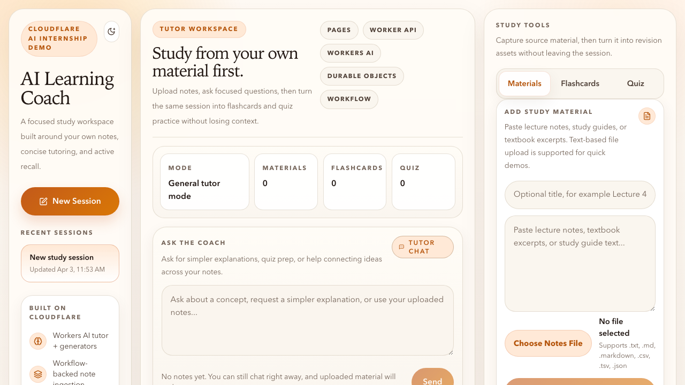
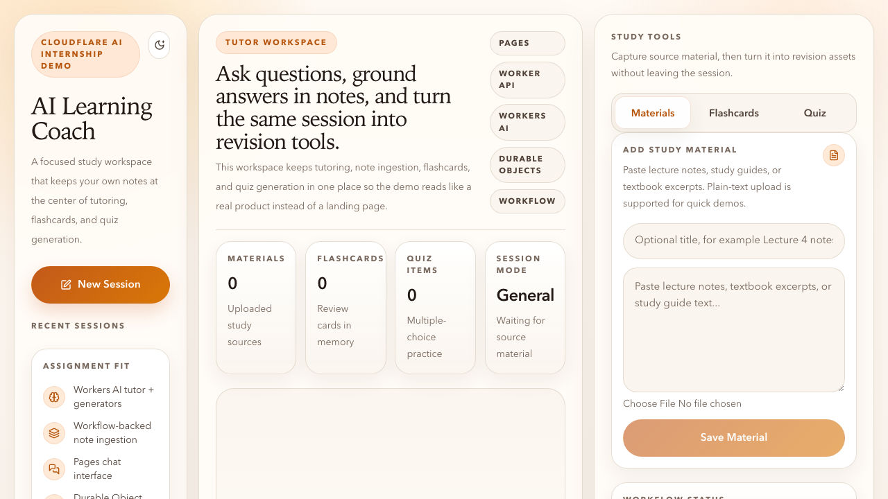
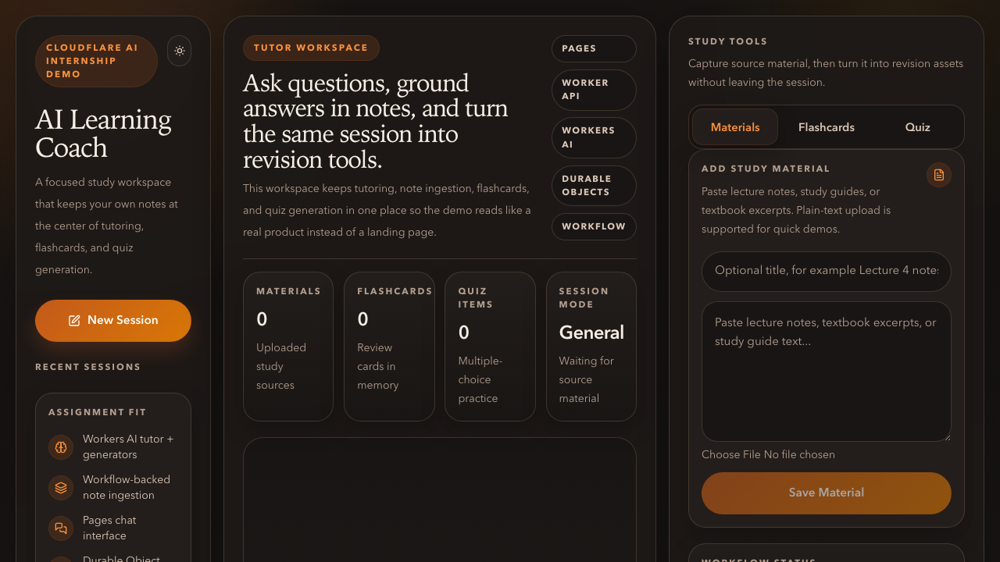
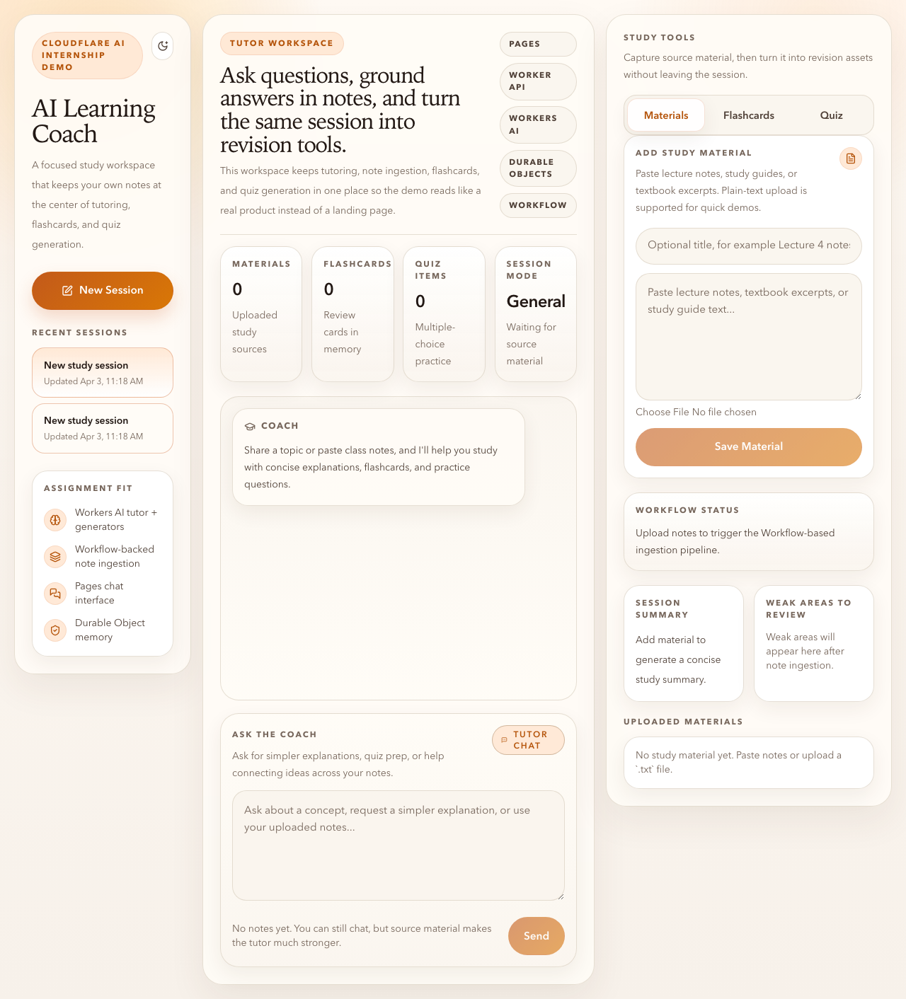
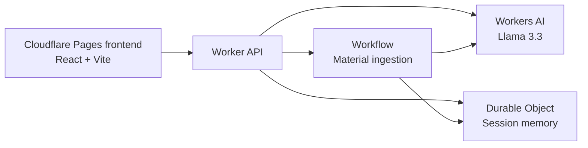

# AI Learning Coach

AI Learning Coach is a Cloudflare-native study assistant built for the Cloudflare AI application assignment. It helps a student study from their own notes first: upload class material, ask questions in chat, generate flashcards, and create quiz practice from the same persistent session.

The GitHub repository name remains `cf_ai_cloudflare_app`, as required by the assignment. The product identity inside the app, code, prompts, and documentation has been fully refactored to match the AI Learning Coach concept.

Repository URL: [https://github.com/Jomak-x/cf_ai_cloudflare_app](https://github.com/Jomak-x/cf_ai_cloudflare_app)

## Screenshots

### Chat-first opening view



### Light mode



### Dark mode



### Full workspace



## Use Case

This app is designed for a simple but strong demo scenario:

- a student pastes lecture notes or uploads a supported text-based file such as `.txt`, `.md`, `.csv`, `.tsv`, or `.json`
- the student can start typing in the tutor box immediately on first open
- the app summarizes the notes and extracts key concepts
- the student asks the tutor for explanations in chat
- the app grounds responses in the uploaded material first
- the student turns the same session into flashcards and a quiz
- review happens one card or one question at a time instead of in one long list

It is intentionally narrower and more demo-friendly than NotebookLM: fewer features, faster to understand, and tightly scoped around studying from uploaded material.

## What The App Does

- chat-based tutoring with concise, educational answers
- chat composer visible immediately on open for instant trial use
- note ingestion from pasted text or supported text-based file upload
- Workflow-powered summarization and concept extraction
- flashcard generation with structured JSON output and one-at-a-time review
- quiz generation with structured JSON output and one-question-at-a-time self-testing
- Durable Object session memory for notes, messages, flashcards, quizzes, summaries, and weak areas
- recent session switching in the frontend for fast demos
- light mode and dark mode UI

## Rubric Fit

This project explicitly satisfies every required part of the assignment:

| Assignment requirement | How AI Learning Coach satisfies it | Key implementation |
| --- | --- | --- |
| `LLM` | Uses `Workers AI` with `Llama 3.3` for tutor chat, note summarization, concept extraction, flashcards, and quiz generation. | [src/ai.ts](/Users/jakob/codestuff/Cloudflare-app/llm-chat-app-template/src/ai.ts) |
| `Workflow / coordination` | Uses a Cloudflare `Worker` as the orchestration layer and a Cloudflare `Workflow` to ingest, summarize, and extract concepts from uploaded material. | [src/index.ts](/Users/jakob/codestuff/Cloudflare-app/llm-chat-app-template/src/index.ts), [wrangler.jsonc](/Users/jakob/codestuff/Cloudflare-app/llm-chat-app-template/wrangler.jsonc) |
| `User input via chat or voice` | Uses a chat-first frontend built for `Cloudflare Pages`, including chat, material input, flashcards, and quiz panels. | [app/src/App.tsx](/Users/jakob/codestuff/Cloudflare-app/llm-chat-app-template/app/src/App.tsx) |
| `Memory or state` | Uses a `Durable Object` per study session to persist materials, conversation history, generated outputs, summary, and weak areas. | [src/state.ts](/Users/jakob/codestuff/Cloudflare-app/llm-chat-app-template/src/state.ts) |
| `README.md with clear running instructions` | This file documents setup, architecture, demo flow, deployment, and rubric mapping. | [README.md](/Users/jakob/codestuff/Cloudflare-app/llm-chat-app-template/README.md) |
| `PROMPTS.md with AI prompts used` | Production prompts and the final AI-assisted development prompts are documented. | [PROMPTS.md](/Users/jakob/codestuff/Cloudflare-app/llm-chat-app-template/PROMPTS.md) |
| `Repository name prefixed with cf_ai_` | The GitHub repository is `cf_ai_cloudflare_app`. | [GitHub repository](https://github.com/Jomak-x/cf_ai_cloudflare_app) |

## Architecture



## How The Agent Works

The app behaves like a study coach, not a generic chatbot.

### 1. Material-first study context

When a student uploads notes, the app stores them in the session and treats them as the primary source for later tutoring and generation. The tutor can still use general knowledge, but only to fill in gaps when the uploaded notes are incomplete.

### 2. Workflow-based ingestion

When material is added:

1. the Worker saves the raw material into the session Durable Object
2. a Workflow summarizes the material
3. the Workflow extracts concepts and likely weak areas
4. the Workflow writes those results back into the same session

### 3. Tutor chat

When the student sends a chat message:

1. the Worker appends the user message to the session history
2. it builds a study-context block from:
   - uploaded material summaries
   - extracted concepts
   - weak areas
   - recent messages
3. it calls Workers AI with the tutor system prompt
4. the response is streamed back to the UI over SSE
5. the completed assistant message is persisted in Durable Object memory

### 4. Flashcards and quiz generation

When the student generates flashcards or a quiz:

1. the Worker builds a generation context from the same session memory
2. Workers AI returns structured JSON
3. the app validates the response shape
4. the validated output is persisted to the session
5. the frontend presents study mode one item at a time, with reveal/check interactions instead of dumping everything in a long list

## Cloudflare Services Used

### Workers AI

- tutor chat responses
- note summarization
- concept extraction
- flashcard generation
- quiz generation

### Workers

- API routing
- orchestration
- SSE streaming for chat
- coordination between frontend, AI, Workflow, and Durable Objects

### Workflows

- multi-step note ingestion pipeline
- summary generation
- concept extraction
- weak-area extraction

### Pages

- frontend hosting target for the React application
- chat-based user interface
- chat-first landing state with the composer visible above the message history

### Durable Objects

- per-session study memory
- materials
- conversation history
- flashcards
- quiz results
- summary and weak areas

## Data Model

### Session

- `id`
- `title`
- `createdAt`
- `updatedAt`
- `materials[]`
- `messages[]`
- `flashcards[]`
- `quizzes[]`
- `summary`
- `weakAreas[]`
- `workflowStatus`

### Material

- `id`
- `title`
- `content`
- `summary`
- `concepts[]`
- `createdAt`
- `updatedAt`

## API

- `POST /api/session`
  Create a new study session.
- `GET /api/session/:id`
  Fetch the full session, including workflow status.
- `POST /api/session/:id/material`
  Add study material and start the ingestion workflow.
- `POST /api/session/:id/chat`
  Stream a tutor response over SSE and persist it to memory.
- `POST /api/session/:id/flashcards`
  Generate and persist structured flashcards.
- `POST /api/session/:id/quiz`
  Generate and persist structured quiz questions.

## Project Structure

- [`app/`](/Users/jakob/codestuff/Cloudflare-app/llm-chat-app-template/app)
  React frontend intended for Cloudflare Pages
- [`src/`](/Users/jakob/codestuff/Cloudflare-app/llm-chat-app-template/src)
  Worker API, Durable Object, Workflow, and AI orchestration
- [`docs/screenshots/`](/Users/jakob/codestuff/Cloudflare-app/llm-chat-app-template/docs/screenshots)
  Current UI screenshots used in this README
- [`PROMPTS.md`](/Users/jakob/codestuff/Cloudflare-app/llm-chat-app-template/PROMPTS.md)
  Production prompts and final AI-assisted coding prompts

## Local Setup

### Prerequisites

- Node.js `18+`
- npm
- a Cloudflare account with Workers AI access
- Wrangler authentication

### Install dependencies

```bash
npm install
```

### Optional environment setup

Example env files are included:

- [.env.example](/Users/jakob/codestuff/Cloudflare-app/llm-chat-app-template/.env.example)
- [.dev.vars.example](/Users/jakob/codestuff/Cloudflare-app/llm-chat-app-template/.dev.vars.example)

### Authenticate with Cloudflare

```bash
npx wrangler login
```

### Generate Worker types

```bash
npm run cf-typegen
```

## How To Run Locally

Start the frontend and Worker together:

```bash
npm run dev
```

This starts:

- a Vite frontend on `http://localhost:5173`
- a local Worker API on `http://localhost:8787`

If `5173` is already in use, Vite automatically picks the next open port and prints it in the terminal.

## Verification Commands

Run these before submitting:

```bash
npm test -- --run
npm run check
```

## How To Use The App

### Quick start

1. Open the app in the browser.
2. Click `New Session`.
3. Paste lecture notes or upload a supported text-based file such as `.txt`, `.md`, `.csv`, `.tsv`, or `.json`.
4. Wait for the workflow status to show ingestion progress.
5. Ask the tutor a question right away from the visible chat box.
6. Generate flashcards and review them one card at a time.
7. Generate a quiz and answer one question at a time before revealing the explanation.
8. Switch sessions or refresh to show that memory persists.

### Example study flow

Paste:

```text
Mitosis is the process by which a eukaryotic cell divides to produce two genetically identical daughter cells. The major phases are prophase, metaphase, anaphase, and telophase.
```

Then ask:

```text
Explain mitosis in simpler language and give me a memory trick for the phase order.
```

Then generate:

- flashcards for quick review, one card at a time
- a 5-question quiz for self-testing, one question at a time

## Deployment

### Deploy the Worker API

```bash
npm run deploy
```

### Deploy the frontend to Cloudflare Pages

1. Build the client:

```bash
npm run build:client
```

2. Deploy the generated `dist/` directory to Cloudflare Pages.
3. Set `VITE_API_BASE_URL` in Pages to your deployed Worker URL.

Example:

```text
VITE_API_BASE_URL=https://ai-learning-coach-api.<your-subdomain>.workers.dev
```

For production, set `CORS_ORIGIN` on the Worker to your Pages domain instead of `*`.

## Why This Fits The Assignment Well

This project is intentionally built to be easy to review:

- the Cloudflare services are visible in the code and in the UI story
- the chat interface makes the AI interaction obvious immediately
- the Workflow step shows coordination beyond a single LLM call
- Durable Objects make memory/state concrete and easy to demonstrate
- the app is simple enough to demo in under two minutes

## Originality And AI Assistance

This submission was built specifically for this repository and assignment. AI assistance was used for planning, refactoring, UI iteration, verification, and documentation. The prompts used for the final version are documented in [PROMPTS.md](/Users/jakob/codestuff/Cloudflare-app/llm-chat-app-template/PROMPTS.md).
